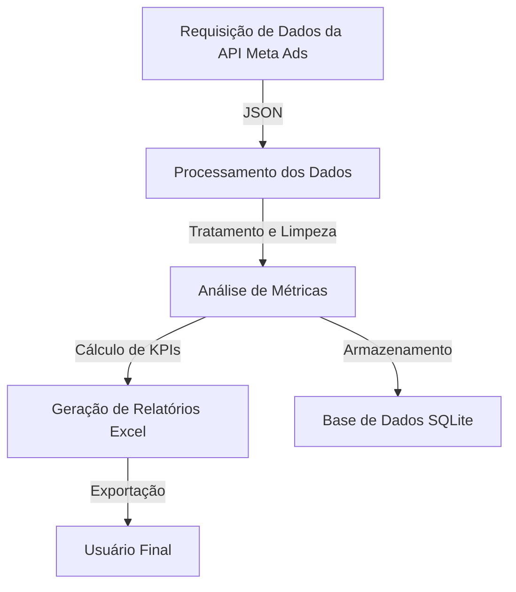

# 📊 Tratamento de Dados - Ser Educacional  

## 📌 Visão Geral
Este projeto tem como objetivo **extrair, tratar e analisar dados de campanhas publicitárias** do **Meta Ads API**, processá-los e gerar **relatórios consolidados no formato Excel**.  

A solução permite automatizar o tratamento dos dados, calcular métricas de desempenho e consolidar informações de forma estruturada, facilitando a análise e a tomada de decisões.  

---

## 🎯 Objetivos do Projeto  

✔ **Carregar arquivos JSON** contendo informações de campanhas publicitárias.  
✔ **Processar os dados**, extraindo métricas como **impressões, alcance, gastos e interações**.  
✔ **Gerar relatórios** detalhados no formato **Excel**.  
✔ **Realizar requisições automáticas** à API do Meta Ads.  
✔ **Mesclar múltiplos arquivos JSON** em um único dataset consolidado.  

---

## 🛠️ Tecnologias Utilizadas  

| Tecnologia | Descrição |
|------------|--------------------------------|
| **Python** | Linguagem principal do projeto |
| **pandas** | Processamento e análise de dados |
| **requests** | Conexão com a API do Meta Ads |
| **json** | Manipulação de arquivos JSON |
| **SQLite** | Armazenamento de dados estruturados (se necessário) |
| **Excel (.xlsx)** | Exportação dos dados tratados |

---

# 📁 Estrutura do Projeto - Tratamento de Dados

````md
📂 TRATAMENTO-DE-DADOS-SER-EDUCACIONAL-2  
├── 📂 Tratamento_dos_dados
│   ├── 📄 341867950349467_insights2224_parte1.json  
│   ├── 📄 652220095673691_insights2224.json  
│   ├── 📄 729097561227405_insights_completo.json  
│   ├── 🗄️ ads_database.db  
│   ├── 🗄️ ads_database.sql  
│   ├── 📜 main.py  
│   ├── 📜 main_no_data.py  
│   ├── 📜 base_no_data.py  
│   ├── 📜 database.py  
│  
├── 📂 scripts  
│   ├── 📜 script_caso_de_erro.py  
│   ├── 📜 script_dados_mesclados.py  
│   ├── 📜 script_primeiro_request.py  
│   ├── 📜 script_todo_dia.py  
│   ├── 📜 scriptunico.py  
│  
├── 📂 naoperder  
│   ├── 📊 processed_data_caruaru.xlsx  
│   ├── 📊 processed_data_caxangá.xlsx  
│   ├── 📊 processed_data_paulista.xlsx  
│  
├── 📂 venv  
│  
└── 📄 README.md  
````

---

## 📊 **Fluxo do Projeto**  
Abaixo está um diagrama ilustrando o funcionamento do projeto:  



# 🚀 Uso do Projeto

## 📌 Pré-requisitos
Antes de começar, instale as bibliotecas necessárias:
```bash
pip install pandas requests openpyxl
```

## 📊 Processamento de Dados
Para executar o processamento de um arquivo JSON e exportar para Excel, utilize o seguinte comando:
```bash
python scripts/main.py
```
📌 Isso irá carregar os dados do JSON, processá-los e gerar um arquivo `processed_data.xlsx` com os resultados.

## 🔄 Mesclar Arquivos JSON
Caso tenha múltiplos arquivos JSON para consolidar, utilize:
```bash
python scripts/mergejson.py
```
📌 Isso criará um único arquivo JSON consolidado com todas as informações dos arquivos existentes.

---

# 📈 Métricas Calculadas
| **Métrica**                | **Descrição**                                        |
|----------------------------|----------------------------------------------------|
| 📊 **Impressões**          | Quantidade de exibições do anúncio                 |
| 👥 **Alcance**             | Número de usuários únicos alcançados              |
| 💰 **Gastos**              | Valor investido na campanha                        |
| 🖱️ **Cliques**            | Número de cliques nos anúncios                     |
| 🔄 **Engajamentos**        | Interações como curtidas e compartilhamentos       |
| 🎯 **Leads**               | Quantidade de contatos gerados                     |
| 📈 **CTR (Click-Through Rate)** | Taxa de cliques sobre impressões           |
| 💵 **CPL (Custo por Lead)** | Custo médio por lead gerado                        |

---

# 📡 Configuração do Meta Ads API

## 🔑 Passos para configurar a API:
1️⃣ **Configure sua chave de acesso do Meta Ads**:
```bash
export META_ACCESS_TOKEN="SEU_TOKEN_AQUI"  # Linux/macOS
$env:META_ACCESS_TOKEN="SEU_TOKEN_AQUI"   # Windows PowerShell
```

2️⃣ **Execute o script para baixar os insights das campanhas**:
```bash
python scripts/fetch_all_insights.py
```

3️⃣ **O arquivo JSON com os dados será salvo automaticamente na pasta `/data`.**

---

# 🛠️ Possíveis Erros e Soluções

### ❌ Erro: `FileNotFoundError`
**Causa:** O arquivo JSON gerado ainda não existe ou está salvo em um local diferente.  
✅ **Solução:** Certifique-se de rodar primeiro o script `fetch_all_insights.py` antes de rodar `main.py`.

### ❌ Erro: `UnicodeDecodeError` ao abrir o JSON
**Causa:** O arquivo pode estar corrompido ou salvo com uma codificação errada.  
✅ **Solução:** Abra o JSON com `utf-8` explicitamente no código:
```python
with open("arquivo.json", "r", encoding="utf-8") as f:
```

### ❌ Erro: API retornando lista vazia
**Causa:** O `time_range` pode estar mal formatado ou a API não está retornando dados.  
✅ **Solução:** Utilize `json.dumps()` corretamente ao definir `time_range`:
```python
"time_range": json.dumps({"since": "2022-06-01", "until": "2024-12-31"})
```

---
